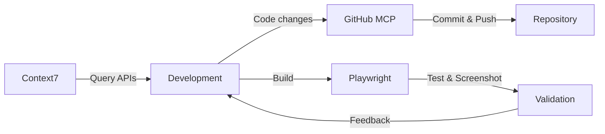

# Conversation Persistence & RAG Integration Specification

## Overview

This document specifies the implementation of conversation persistence, history management, and enhanced RAG integration for AlgoMate.

## Features

### 1. Frontend - Conversation History Sidebar
- Add conversation history cards to sidebar
- Display conversation summary/title if history exists
- Click to load historical conversation

### 2. Frontend - New Conversation
- Add "New Conversation" button
- No concurrent conversations supported
- Generate random ID for new conversation
- Replace title with AI-generated summary after first message

### 3. Backend RAG - Persistence
- File-based conversation storage
- All messages in current conversation are persisted

### 4. Backend RAG - Smart Vector Storage
- Retrieve from vector DB during conversation
- Store only if semantic similarity is low (new information)
- Use LLM to generate confidence score for algorithm relevance
- Skip storage for non-algorithm-related content

### 5. Backend Agent - Session Persistence
- Support session management
- Persist agent conversations

### 6. Frontend - Mode Switching
- When switching RAG/Agent modes, load most recent conversation
- Create new conversation if none exists

### 7. Backend Agent - RAG Enhancement
- Perform RAG retrieval before agent processing
- Generate enhanced context for agent

---

## MCP Services Integration

This project leverages three MCP (Model Context Protocol) services to enhance development workflow, testing, and documentation.

### 1. GitHub MCP Service

**Capabilities:**
- Repository management and code versioning
- Automated commits with semantic messages
- Branch management and pull requests
- Code review assistance

**Usage in this project:**
```bash
# Commit conversation persistence feature
git add backend/app/core/session_manager.py
git commit -m "feat(session): add file-based conversation persistence"

# Push to remote repository
git push origin feature/conversation-persistence
```

**Development Workflow:**
1. Create feature branch for each Phase
2. Commit incremental changes with conventional commits
3. Push to GitHub for backup and collaboration
4. Use PR reviews for code quality

### 2. Context7 MCP Service

**Capabilities:**
- Query up-to-date library documentation
- Retrieve code examples and API references
- Resolve library IDs for accurate queries

**Usage Examples:**

```typescript
// Query react-markdown best practices
const libraryId = await resolveLibraryId("react-markdown");
const docs = await queryDocs(libraryId, 
  "How to render task lists with checkboxes?");

// Query remark-gfm for table rendering
const gfmDocs = await queryDocs("/remarkjs/remark-gfm", 
  "Task list AST structure and component mapping");
```

**Applied in this project:**
- **MessageItem.tsx**: Used Context7 to correctly implement GFM table and task list rendering
- **SessionManager**: Query Python file I/O best practices
- **Vector Storage**: Research ChromaDB and embedding techniques

### 3. Playwright MCP Service

**Capabilities:**
- Browser automation and E2E testing
- Visual regression testing
- Screenshot capture for UI validation
- Form interaction and navigation testing

**Test Scenarios for Conversation Persistence:**

```typescript
// Test 1: Create new conversation
test('create new conversation', async ({ page }) => {
  await page.goto('http://localhost:5173');
  await page.click('[data-testid="new-conversation-btn"]');
  await expect(page.locator('[data-testid="session-title"]'))
    .toHaveText('New Conversation');
});

// Test 2: Conversation history display
test('display conversation history', async ({ page }) => {
  await page.goto('http://localhost:5173');
  const cards = await page.locator('.conversation-card').count();
  expect(cards).toBeGreaterThan(0);
});

// Test 3: Switch between conversations
test('switch conversation', async ({ page }) => {
  await page.click('.conversation-card:nth-child(2)');
  await expect(page.locator('.conversation-card.active')).toBeVisible();
});

// Test 4: Visual regression - sidebar layout
await page.screenshot({
  path: 'conversation-sidebar.png',
  clip: { x: 0, y: 0, width: 260, height: 800 }
});
```

**UI Validation Tests:**
1. **Layout Test**: Verify sidebar shows conversation cards correctly
2. **Interaction Test**: Click conversation card loads correct session
3. **State Test**: New conversation button generates unique ID
4. **Visual Test**: Screenshot comparison for regression detection

### Combined MCP Workflow



**Example Session:**

1. **Research Phase** (Context7):
   - Query React state management patterns
   - Research file-based storage best practices
   - Look up ChromaDB metadata filtering

2. **Development Phase** (GitHub):
   ```bash
   git checkout -b feat/conversation-persistence
   # Implement SessionManager
   git add backend/app/core/session_manager.py
   git commit -m "feat(session): add SessionManager with CRUD operations"
   ```

3. **Testing Phase** (Playwright):
   - Automated browser tests for conversation flow
   - Screenshot capture for UI review
   - Form submission and validation

4. **Documentation Phase** (Context7 + GitHub):
   - Query documentation for accurate API references
   - Commit updated specification
   - Push to remote repository

---

## Data Models

### Conversation Session

```typescript
interface ConversationSession {
    id: string;                    // UUID v4
    type: 'rag' | 'agent';         // Conversation type
    title: string;                 // Auto-generated summary or "New Conversation"
    createdAt: number;             // Timestamp
    updatedAt: number;             // Timestamp
    messageCount: number;          // Number of messages
    lastMessagePreview: string;    // Preview of last message (first 50 chars)
}

interface ConversationMessage {
    id: string;
    sessionId: string;
    role: 'user' | 'assistant' | 'system';
    content: string;
    timestamp: number;
    metadata?: {
        isRelevantToAlgorithm?: boolean;  // LLM judged relevance
        confidenceScore?: number;          // 0-1 relevance score
        vectorStored?: boolean;            // Whether stored in vector DB
    };
}
```

### Storage Structure

```
data/
├── chat_history/
│   ├── sessions.json              # Index of all sessions
│   ├── rag/
│   │   ├── session_{id}.json      # Individual RAG session
│   │   └── session_{id}.json
│   └── agent/
│       ├── session_{id}.json      # Individual Agent session
│       └── session_{id}.json
```

---

## API Endpoints

### Session Management

```yaml
# List all sessions
GET /api/sessions?type=rag|agent
Response: {
    sessions: ConversationSession[]
}

# Get specific session
GET /api/sessions/{sessionId}
Response: {
    session: ConversationSession,
    messages: ConversationMessage[]
}

# Create new session
POST /api/sessions
Body: {
    type: 'rag' | 'agent',
    title?: string  // Optional, defaults to "New Conversation"
}
Response: {
    session: ConversationSession
}

# Delete session
DELETE /api/sessions/{sessionId}

# Update session title
PATCH /api/sessions/{sessionId}
Body: {
    title: string
}
```

### Chat Endpoints (Modified)

```yaml
# RAG Chat
POST /api/rag/chat
Body: {
    message: string,
    sessionId: string,           # Required
    context?: string             # Optional context from history
}

# Agent Chat
POST /api/agent/chat
Body: {
    message: string,
    sessionId: string,           # Required
    problemDescription?: string,
    language?: string
}

# Generate conversation summary
POST /api/sessions/{sessionId}/summarize
Response: {
    title: string
}
```

---

## Frontend Implementation

### 1. Store Updates

```typescript
// stores/chatStore.ts - Add session management
interface ChatState {
    // Existing
    messages: Message[];
    isLoading: boolean;
    
    // New session management
    currentSessionId: string | null;
    sessionType: 'rag' | 'agent';
    sessions: ConversationSession[];
    
    // Actions
    createSession: (type: 'rag' | 'agent') => Promise<string>;
    loadSession: (sessionId: string) => Promise<void>;
    deleteSession: (sessionId: string) => Promise<void>;
    loadRecentSession: (type: 'rag' | 'agent') => Promise<void>;
    generateSummary: (sessionId: string) => Promise<string>;
}
```

### 2. Sidebar Component Update

```tsx
// components/Sidebar/index.tsx
export function Sidebar() {
    const { sessions, currentSessionId, loadSession, createSession } = useChatStore();
    
    return (
        <aside className="sidebar">
            {/* Existing mode selector */}
            <ModeSelector />
            
            {/* New Conversation Button */}
            <button onClick={() => createSession(sessionType)}>
                + New Conversation
            </button>
            
            {/* Conversation History */}
            <div className="conversation-list">
                {sessions.map(session => (
                    <ConversationCard
                        key={session.id}
                        session={session}
                        isActive={session.id === currentSessionId}
                        onClick={() => loadSession(session.id)}
                        onDelete={() => deleteSession(session.id)}
                    />
                ))}
            </div>
            
            {/* Existing config sections */}
            <AgentConfig />
        </aside>
    );
}
```

### 3. Conversation Card Component

```tsx
// components/Sidebar/ConversationCard.tsx
interface ConversationCardProps {
    session: ConversationSession;
    isActive: boolean;
    onClick: () => void;
    onDelete: () => void;
}

export function ConversationCard({ session, isActive, onClick, onDelete }: ConversationCardProps) {
    return (
        <div 
            className={`conversation-card ${isActive ? 'active' : ''}`}
            onClick={onClick}
        >
            <div className="title">{session.title}</div>
            <div className="meta">
                <span>{new Date(session.updatedAt).toLocaleDateString()}</span>
                <span>{session.messageCount} messages</span>
            </div>
            <button onClick={(e) => { e.stopPropagation(); onDelete(); }}>
                🗑️
            </button>
        </div>
    );
}
```

### 4. Mode Switching Logic

```typescript
// In ModeSelector or App.tsx
useEffect(() => {
    // When mode changes, load most recent session or create new
    const initSession = async () => {
        const recentSession = sessions.find(s => s.type === currentMode);
        if (recentSession) {
            await loadSession(recentSession.id);
        } else {
            await createSession(currentMode);
        }
    };
    initSession();
}, [currentMode]);
```

---

## Backend Implementation

### 1. Session Storage Module

```python
# backend/app/core/session_manager.py
import json
import os
from datetime import datetime
from typing import List, Optional, Dict, Any
from uuid import uuid4
from pathlib import Path

class SessionManager:
    def __init__(self, base_path: str = "data/chat_history"):
        self.base_path = Path(base_path)
        self.base_path.mkdir(parents=True, exist_ok=True)
        
        # Ensure subdirectories exist
        (self.base_path / "rag").mkdir(exist_ok=True)
        (self.base_path / "agent").mkdir(exist_ok=True)
    
    def _get_session_path(self, session_id: str, session_type: str) -> Path:
        return self.base_path / session_type / f"session_{session_id}.json"
    
    def _get_index_path(self) -> Path:
        return self.base_path / "sessions.json"
    
    def _load_index(self) -> List[Dict[str, Any]]:
        index_path = self._get_index_path()
        if not index_path.exists():
            return []
        with open(index_path, 'r', encoding='utf-8') as f:
            return json.load(f)
    
    def _save_index(self, sessions: List[Dict[str, Any]]):
        with open(self._get_index_path(), 'w', encoding='utf-8') as f:
            json.dump(sessions, f, ensure_ascii=False, indent=2)
    
    def create_session(self, session_type: str, title: str = None) -> Dict[str, Any]:
        """Create a new session"""
        session_id = str(uuid4())
        now = datetime.now().isoformat()
        
        session = {
            "id": session_id,
            "type": session_type,
            "title": title or "New Conversation",
            "createdAt": now,
            "updatedAt": now,
            "messageCount": 0,
            "lastMessagePreview": ""
        }
        
        # Save session file
        session_path = self._get_session_path(session_id, session_type)
        with open(session_path, 'w', encoding='utf-8') as f:
            json.dump({
                "session": session,
                "messages": []
            }, f, ensure_ascii=False, indent=2)
        
        # Update index
        index = self._load_index()
        index.append(session)
        self._save_index(index)
        
        return session
    
    def get_session(self, session_id: str) -> Optional[Dict[str, Any]]:
        """Load a specific session with messages"""
        # Find in index
        index = self._load_index()
        session_meta = next((s for s in index if s["id"] == session_id), None)
        if not session_meta:
            return None
        
        # Load full session
        session_path = self._get_session_path(session_id, session_meta["type"])
        if not session_path.exists():
            return None
        
        with open(session_path, 'r', encoding='utf-8') as f:
            return json.load(f)
    
    def add_message(self, session_id: str, message: Dict[str, Any]):
        """Add message to session"""
        session_data = self.get_session(session_id)
        if not session_data:
            raise ValueError(f"Session {session_id} not found")
        
        # Add message
        message["id"] = str(uuid4())
        message["timestamp"] = datetime.now().isoformat()
        session_data["messages"].append(message)
        
        # Update session metadata
        session = session_data["session"]
        session["messageCount"] = len(session_data["messages"])
        session["updatedAt"] = datetime.now().isoformat()
        session["lastMessagePreview"] = message["content"][:50] + "..." if len(message["content"]) > 50 else message["content"]
        
        # Save session
        session_path = self._get_session_path(session_id, session["type"])
        with open(session_path, 'w', encoding='utf-8') as f:
            json.dump(session_data, f, ensure_ascii=False, indent=2)
        
        # Update index
        index = self._load_index()
        for i, s in enumerate(index):
            if s["id"] == session_id:
                index[i] = session
                break
        self._save_index(index)
    
    def list_sessions(self, session_type: str = None) -> List[Dict[str, Any]]:
        """List all sessions, optionally filtered by type"""
        index = self._load_index()
        if session_type:
            index = [s for s in index if s["type"] == session_type]
        # Sort by updatedAt descending
        return sorted(index, key=lambda x: x["updatedAt"], reverse=True)
    
    def delete_session(self, session_id: str):
        """Delete a session"""
        index = self._load_index()
        session_meta = next((s for s in index if s["id"] == session_id), None)
        if not session_meta:
            return
        
        # Delete file
        session_path = self._get_session_path(session_id, session_meta["type"])
        if session_path.exists():
            session_path.unlink()
        
        # Update index
        index = [s for s in index if s["id"] != session_id]
        self._save_index(index)
    
    def update_title(self, session_id: str, title: str):
        """Update session title"""
        index = self._load_index()
        for s in index:
            if s["id"] == session_id:
                s["title"] = title
                break
        self._save_index(index)
```

### 2. RAG Module with Smart Storage

```python
# backend/app/rag/conversation_rag.py
from typing import List, Dict, Any
import numpy as np
from langchain_openai import OpenAIEmbeddings, ChatOpenAI
from langchain.prompts import ChatPromptTemplate

class ConversationRAG:
    def __init__(self, vector_store, session_manager, llm):
        self.vector_store = vector_store
        self.session_manager = session_manager
        self.llm = llm
        self.embeddings = OpenAIEmbeddings()
        
        # Prompt for relevance checking
        self.relevance_prompt = ChatPromptTemplate.from_template("""
        Analyze the following conversation content and determine if it's relevant to algorithm learning.
        
        Content: {content}
        
        Rate the relevance on a scale of 0-1 where:
        - 1.0: Directly related to algorithms, data structures, coding problems
        - 0.5: Somewhat related to programming or computer science
        - 0.0: Completely unrelated (casual chat, greetings, etc.)
        
        Respond with ONLY a JSON object:
        {{
            "isRelevant": true/false,
            "confidenceScore": 0.0-1.0,
            "reason": "brief explanation"
        }}
        """)
    
    async def should_store_in_vector_db(self, content: str) -> Dict[str, Any]:
        """Determine if content should be stored in vector DB"""
        # First, retrieve similar documents
        similar_docs = await self.vector_store.similarity_search(content, k=3)
        
        if similar_docs:
            # Check similarity scores
            query_embedding = await self.embeddings.aembed_query(content)
            doc_embeddings = [doc.get('embedding') for doc in similar_docs if doc.get('embedding')]
            
            if doc_embeddings:
                # Calculate cosine similarity
                similarities = [
                    np.dot(query_embedding, doc_emb) / (np.linalg.norm(query_embedding) * np.linalg.norm(doc_emb))
                    for doc_emb in doc_embeddings
                ]
                max_similarity = max(similarities)
                
                # If very similar content exists, don't store
                if max_similarity > 0.85:
                    return {
                        "shouldStore": False,
                        "reason": f"High similarity ({max_similarity:.2f}) with existing content"
                    }
        
        # Use LLM to judge relevance
        chain = self.relevance_prompt | self.llm
        response = await chain.ainvoke({"content": content})
        
        try:
            import json
            result = json.loads(response.content)
            
            # Only store if relevant and confidence > 0.6
            should_store = result.get("isRelevant", False) and result.get("confidenceScore", 0) > 0.6
            
            return {
                "shouldStore": should_store,
                "confidenceScore": result.get("confidenceScore", 0),
                "reason": result.get("reason", "")
            }
        except:
            # Default to storing if parsing fails
            return {
                "shouldStore": True,
                "confidenceScore": 0.5,
                "reason": "Parsing failed, defaulting to store"
            }
    
    async def process_message(self, session_id: str, message: str, role: str = "user"):
        """Process a message: store session, optionally add to vector DB"""
        # 1. Add to session storage
        message_obj = {
            "role": role,
            "content": message
        }
        self.session_manager.add_message(session_id, message_obj)
        
        # 2. For assistant messages, check if should store in vector DB
        if role == "assistant":
            relevance_check = await self.should_store_in_vector_db(message)
            
            if relevance_check["shouldStore"]:
                # Store in vector DB with metadata
                await self.vector_store.add_texts(
                    texts=[message],
                    metadatas=[{
                        "sessionId": session_id,
                        "type": "conversation",
                        "confidenceScore": relevance_check["confidenceScore"]
                    }]
                )
            
            # Update message with metadata
            message_obj["metadata"] = {
                "isRelevantToAlgorithm": relevance_check["shouldStore"],
                "confidenceScore": relevance_check["confidenceScore"],
                "vectorStored": relevance_check["shouldStore"]
            }
    
    async def get_enhanced_context(self, query: str, session_id: str, k: int = 3) -> str:
        """Get RAG-enhanced context for query"""
        # 1. Retrieve from vector DB
        vector_results = await self.vector_store.similarity_search(query, k=k)
        
        # 2. Retrieve from current session history
        session_data = self.session_manager.get_session(session_id)
        session_history = ""
        if session_data and session_data["messages"]:
            # Get last 5 messages for context
            recent_messages = session_data["messages"][-5:]
            session_history = "\n".join([
                f"{msg['role']}: {msg['content']}"
                for msg in recent_messages
            ])
        
        # 3. Combine contexts
        context_parts = []
        
        if vector_results:
            context_parts.append("Relevant knowledge from database:")
            for doc in vector_results:
                context_parts.append(f"- {doc['content']}")
        
        if session_history:
            context_parts.append("\nCurrent conversation context:")
            context_parts.append(session_history)
        
        return "\n".join(context_parts)
```

### 3. Enhanced RAG Endpoint

```python
# backend/app/api/routes.py - Modified chat endpoint
from fastapi import APIRouter, HTTPException
from pydantic import BaseModel

class ChatRequest(BaseModel):
    message: str
    sessionId: str

@router.post("/rag/chat")
async def rag_chat(request: ChatRequest):
    """RAG chat with session persistence"""
    try:
        # 1. Validate session exists
        session = session_manager.get_session(request.sessionId)
        if not session:
            raise HTTPException(status_code=404, detail="Session not found")
        
        # 2. Store user message
        await conversation_rag.process_message(
            request.sessionId,
            request.message,
            role="user"
        )
        
        # 3. Get enhanced context
        context = await conversation_rag.get_enhanced_context(
            request.message,
            request.sessionId
        )
        
        # 4. Generate response with context
        response = await rag_service.chat(request.message, context)
        
        # 5. Store assistant response
        await conversation_rag.process_message(
            request.sessionId,
            response,
            role="assistant"
        )
        
        # 6. If first message, generate summary
        if session["session"]["messageCount"] == 1:
            summary = await generate_conversation_summary(request.sessionId)
            session_manager.update_title(request.sessionId, summary)
        
        return {"response": response}
    
    except Exception as e:
        raise HTTPException(status_code=500, detail=str(e))

async def generate_conversation_summary(session_id: str) -> str:
    """Generate a summary title for the conversation"""
    session_data = session_manager.get_session(session_id)
    if not session_data or not session_data["messages"]:
        return "New Conversation"
    
    first_message = session_data["messages"][0]["content"]
    
    # Use LLM to generate summary
    prompt = ChatPromptTemplate.from_template("""
    Based on the following first message of a conversation, generate a concise 3-5 word title.
    The title should capture the main topic or question.
    
    Message: {message}
    
    Respond with ONLY the title, no quotes or additional text.
    """)
    
    chain = prompt | llm
    response = await chain.ainvoke({"message": first_message[:200]})
    
    return response.content.strip()[:50] or "New Conversation"
```

### 4. Enhanced Agent with RAG

```python
# backend/app/agent/enhanced_agent.py
class EnhancedAgent:
    def __init__(self, llm, session_manager, conversation_rag):
        self.llm = llm
        self.session_manager = session_manager
        self.conversation_rag = conversation_rag
        self.react_agent = ReactAgent(llm)  # Existing agent
    
    async def process(
        self,
        problem_description: str,
        session_id: str,
        language: str = "python"
    ):
        """Process with RAG-enhanced context"""
        # 1. Store user message
        self.session_manager.add_message(session_id, {
            "role": "user",
            "content": problem_description
        })
        
        # 2. Get RAG context
        rag_context = await self.conversation_rag.get_enhanced_context(
            problem_description,
            session_id
        )
        
        # 3. Enhance problem description with context
        enhanced_problem = f"""
{problem_description}

[Additional Context from Knowledge Base]
{rag_context}
"""
        
        # 4. Process with existing agent
        result = await self.react_agent.process(
            enhanced_problem,
            language=language
        )
        
        # 5. Store result
        self.session_manager.add_message(session_id, {
            "role": "assistant",
            "content": result.get("final_answer", ""),
            "metadata": {
                "generatedCode": result.get("generated_code"),
                "executionResult": result.get("execution_result"),
                "isSolved": result.get("is_solved")
            }
        })
        
        # 6. Update title if first message
        session = self.session_manager.get_session(session_id)
        if session and session["session"]["messageCount"] == 1:
            summary = await self._generate_agent_summary(problem_description)
            self.session_manager.update_title(session_id, summary)
        
        return result
    
    async def _generate_agent_summary(self, problem: str) -> str:
        """Generate summary for agent conversation"""
        prompt = ChatPromptTemplate.from_template("""
        Based on this programming problem, generate a concise 3-5 word title.
        Focus on the algorithm or problem type.
        
        Problem: {problem}
        
        Respond with ONLY the title.
        """)
        
        chain = prompt | self.llm
        response = await chain.ainvoke({"problem": problem[:200]})
        return response.content.strip()[:50] or "Coding Problem"
```

---

## Implementation Order

### Phase 1: Core Session Management
1. [ ] Implement `SessionManager` class
2. [ ] Add session API endpoints
3. [ ] Update frontend store with session management
4. [ ] Add conversation list to sidebar
5. [ ] Implement "New Conversation" button

### Phase 2: RAG Enhancement
1. [ ] Implement `ConversationRAG` class
2. [ ] Add relevance checking logic
3. [ ] Update RAG chat endpoint
4. [ ] Implement auto-summary generation

### Phase 3: Agent Enhancement
1. [ ] Implement `EnhancedAgent` class
2. [ ] Add RAG retrieval to agent
3. [ ] Update agent chat endpoint
4. [ ] Add agent session persistence

### Phase 4: Frontend Integration
1. [ ] Implement mode switching with session loading
2. [ ] Add conversation card UI
3. [ ] Implement delete conversation
4. [ ] Add loading states and error handling

---

## Configuration

```yaml
# backend/app/config/session.yaml
session:
  storage_path: "data/chat_history"
  max_sessions_per_user: 100
  auto_summarize: true
  
  vector_storage:
    similarity_threshold: 0.85
    min_confidence_score: 0.6
    max_history_context: 5  # messages
```

---

## Notes

1. **No Concurrent Conversations**: Each user can only have one active conversation per mode (RAG/Agent). Switching conversations pauses the previous one.

2. **File Storage**: Current implementation uses JSON files for simplicity. Can be migrated to SQLite or other DB later.

3. **Vector Storage Optimization**: Only store content with confidence score > 0.6 to keep vector DB clean and relevant.

4. **Privacy Considerations**: All data stored locally in `data/` directory. No cloud storage.

5. **Performance**: Load recent session list on app startup, load full conversation on-demand.
