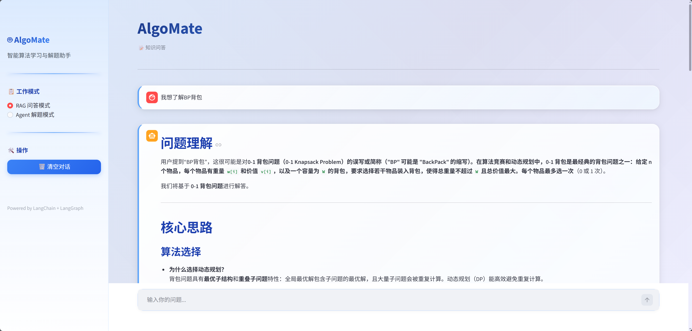

# 🤖 AlgoMate - 智能算法辅导 AI Agent

> README is generated By 🌙 Kimi

AlgoMate 是一个基于 **LangGraph + ReAct 架构** 的智能算法辅导系统，能够自动分析算法题目、编写代码、执行测试并在出错时自主修复。

---

## ✨ 核心特性

| 特性 | 描述 |
|------|------|
| 🧠 **ReAct Agent** | 基于推理-行动的自主循环，自动解决问题 |
| 📚 **RAG 知识增强** | 基于向量检索的算法知识库问答 |
| 🖥️ **代码沙箱** | 支持 Python/C++/Java 的安全代码执行环境 |
| 🔄 **自动修复** | 代码失败后自动分析错误并修复（最多5次迭代） |
| 🧪 **智能测试** | 自动生成边界测试用例，含自验证机制 |
| 💬 **流式展示** | Web 界面实时展示 Agent 思考过程 |

---

## 📁 项目结构

```
algomate/
├── 🎭 agent/                  # ReAct Agent 核心
│   ├── __init__.py
│   ├── react_agent.py         # 主 Agent 类
│   ├── state.py               # Agent 状态定义
│   └── nodes.py               # ReAct 节点实现
├── 🔍 rag/                     # RAG 功能
│   ├── rag.py                 # RAG 服务
│   ├── vector_stores.py       # 向量存储（支持知识库预热）
│   └── file_history_store.py
├── 🛠️ tools/                   # 工具集
│   ├── __init__.py
│   └── code_executor.py       # 代码执行沙箱
├── 🧰 utils/                   # 工具模块
│   ├── config_handler.py      # YAML 配置加载器
│   ├── prompts_loader.py      # Prompt 模板加载
│   ├── file_handler.py        # 文件处理（MD5/加载）
│   ├── path_tool.py           # 路径工具
│   └── logger_handler.py      # 结构化日志
├── ⚙️ config/                  # 配置目录（YAML）
│   ├── storage.yaml           # 存储路径配置
│   ├── chroma.yaml            # Chroma 数据库配置
│   ├── model.yaml             # AI 模型配置
│   ├── splitter.yaml          # 文本分割配置
│   ├── agent.yaml             # Agent 参数配置
│   └── ...
├── 📝 prompts/                 # Prompt 模板
│   ├── analysis_prompt.txt
│   ├── test_case_generation_prompt.txt
│   └── ...
├── 💾 data/                    # 数据目录
│   ├── knowledge_base/        # 📖 内部知识库（PDF/TXT）
│   ├── chromd_db/             # Chroma 持久化数据
│   └── md5.text               # 文件去重记录
├── 📜 scripts/                 # 工具脚本
│   └── warmup_knowledge_base.py
├── 🌐 algomate_web.py          # Streamlit Web 界面
├── ✅ test_agent.py            # 测试脚本
└── 📦 requirements.txt         # 依赖
```

---

## 🚀 快速开始

### 1️⃣ 安装依赖

```bash
pip install -r requirements.txt
```

依赖包括：
- 🦜 `langchain` + `langgraph`: Agent 框架
- 🎈 `streamlit`: Web 界面
- 💫 `chromadb`: 向量数据库
- 🌟 `dashscope`: 通义千问模型

### 2️⃣ 配置模型

编辑 `config/model.yaml`:

```yaml
# 🔧 使用 DashScope (通义千问)
embedding_model_name: "text-embedding-v4"
chat_model_name: "qwen3-max"

# 🌐 或使用 OpenAI
# chat_model_name: "gpt-4"
```

> ⚠️ **重要**: 如果知识库已用某个 embedding 模型预热，检索必须使用**同一模型**！

设置 API Key:

```bash
# Linux/macOS
export DASHSCOPE_API_KEY="your-api-key"

# Windows
set DASHSCOPE_API_KEY=your-api-key
```

### 3️⃣ 知识库预热（可选）

将算法文档放入 `data/knowledge_base/`，然后预热：

```bash
# 🔥 预热知识库（加载 PDF/TXT 到向量数据库）
python scripts/warmup_knowledge_base.py

# 🔥 预热 + 检索测试
python scripts/warmup_knowledge_base.py --test-query "动态规划"

# 🔥 只预热不测试
python scripts/warmup_knowledge_base.py --no-test
```

**⏱️ 预热时间参考**（text-embedding-v4）：
| 文件大小 | 预估时间 |
|---------|---------|
| 📄 20MB PDF | ~3-5 分钟 |
| 📄 50MB PDF | ~5-8 分钟 |

### 4️⃣ 运行 Web 界面

```bash
streamlit run algomate_web.py
```

访问 👉 `http://localhost:8501`

---

## 📖 使用指南

### 📚 模式一：RAG 问答模式

适合算法概念学习、知识点查询。



1. 📤 上传算法知识文档（PDF/TXT 格式）到 `data/knowledge_base/`
2. 🔥 执行预热脚本加载文档
3. 🎯 在 Web 界面选择 "RAG 问答模式"
4. 💬 输入问题，如：
   - "解释一下动态规划的核心思想"
   - "二分查找的时间复杂度是多少？"

### 🎮 模式二：Agent 解题模式

适合实际编程练习。

1. 🎯 在 Web 界面选择 "Agent 解题模式"
2. 📝 选择编程语言（Python/C++/Java）
3. ⚙️ 设置最大修复次数（默认 5 次）
4. 📋 输入题目描述，如：

```
📝 题目：两数之和

给定一个整数数组 nums 和一个整数目标值 target，
请你在该数组中找出和为目标值 target 的那两个整数，
并返回它们的数组下标。

示例：
输入：nums = [2,7,11,15], target = 9
输出：[0,1]
```

5. 🤖 Agent 会自动执行：
   ```
   🧠 分析 → 🧪 生成测试 → ✅ 自验证 → 💻 编写代码
              ↓                      ↓
         🔄 自动修复 ← ❌ 测试失败 ← 🚀 执行测试
              ↓
         ✅ 完成报告
   ```

---

## ⚙️ 配置系统

项目使用 **YAML 模块化配置**，位于 `config/` 目录：

| 配置文件 | 说明 | 关键参数 |
|----------|------|----------|
| `model.yaml` | 🤖 AI 模型 | `embedding_model_name`, `chat_model_name` |
| `chroma.yaml` | 💫 向量数据库 | `collection_name`, `data_path` |
| `splitter.yaml` | ✂️ 文本分割 | `chunk_size`, `chunk_overlap` |
| `search.yaml` | 🔍 检索参数 | `max_search_key` |
| `agent.yaml` | 🎭 Agent 参数 | `max_iterations`, `code_execution_timeout` |
| `storage.yaml` | 💾 存储路径 | `md5_path`, `history_path` |

### 📐 推荐配置（英文算法文档）

`config/splitter.yaml`:
```yaml
# ✂️ 分割块大小（英文算法文档推荐 1500）
chunk_size: 1500

# 📎 块间重叠字符数（推荐 10% = 150）
chunk_overlap: 150
```

---

## 🛡️ 代码执行沙箱

项目实现了两层代码执行安全机制：

### 1️⃣ Subprocess 沙箱（默认）

- ⏱️ 超时控制（默认 10 秒）
- 🧠 内存限制
- 📁 临时目录执行
- 🧹 进程树清理

### 2️⃣ Docker 沙箱（推荐生产环境）

- 🐳 完全容器隔离
- 📊 资源限制（CPU、内存、时间）
- 🚫 无网络访问
- 🔒 文件系统隔离

```bash
pip install docker
```

---

## 🧪 测试用例生成策略

Agent 生成测试用例时遵循以下策略：

| 类型 | 数量 | 目的 | 示例 |
|------|------|------|------|
| 📋 常规用例 | 2 个 | 验证基本功能 | 正常数组输入 |
| ⚡ 边界用例 | 3 个 | 测试极端情况 | 空数组、最大值、单元素 |

> 💡 测试用例在代码生成前会经过**自验证节点**检查，确保预期值正确。

---

## 📊 日志系统

项目使用结构化日志，格式：`[Flow]: Message`

```
2026-03-18 10:00:00 - agent - INFO - nodes.py:46 - [Node-analyze_problem]: 开始分析题目
2026-03-18 10:00:05 - agent - INFO - nodes.py:67 - [Node-analyze_problem]: 题目分析完成
2026-03-18 10:00:10 - agent - ERROR - nodes.py:85 - [Node-execute_code]: 代码执行失败
```

日志文件保存在 `logs/` 目录，按日期分割。

---

## 🛠️ 开发命令

```bash
# ✅ 运行测试
python test_agent.py

# 🔥 知识库预热
python scripts/warmup_knowledge_base.py --test-query "贪心算法"

# ⚙️ 验证配置加载
python -c "from utils.config_handler import load_all_configs; load_all_configs()"
```

---

## ⚠️ 注意事项

1. 🔗 **Embedding 模型一致性**: 预热和检索必须使用同一 embedding 模型，否则维度不匹配会导致检索失败
2. 🔑 **API Key 设置**: 确保 `DASHSCOPE_API_KEY` 或 `OPENAI_API_KEY` 已正确设置
3. 📄 **知识库格式**: 支持 `.txt` 和 `.pdf` 格式，推荐英文算法文档
4. ⏱️ **预热时间**: 大型 PDF 预热可能需要数分钟，请耐心等待

---

## 📜 License

MIT License © 2026 AlgoMate

---

> 🌟 **AlgoMate** - 让算法学习更高效！
